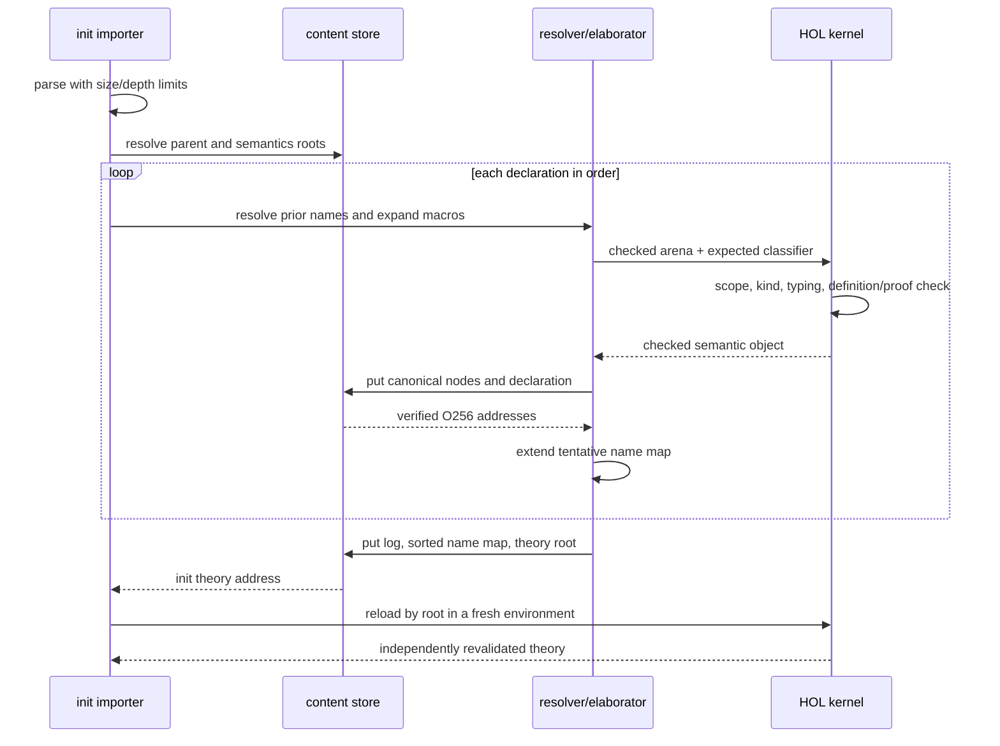
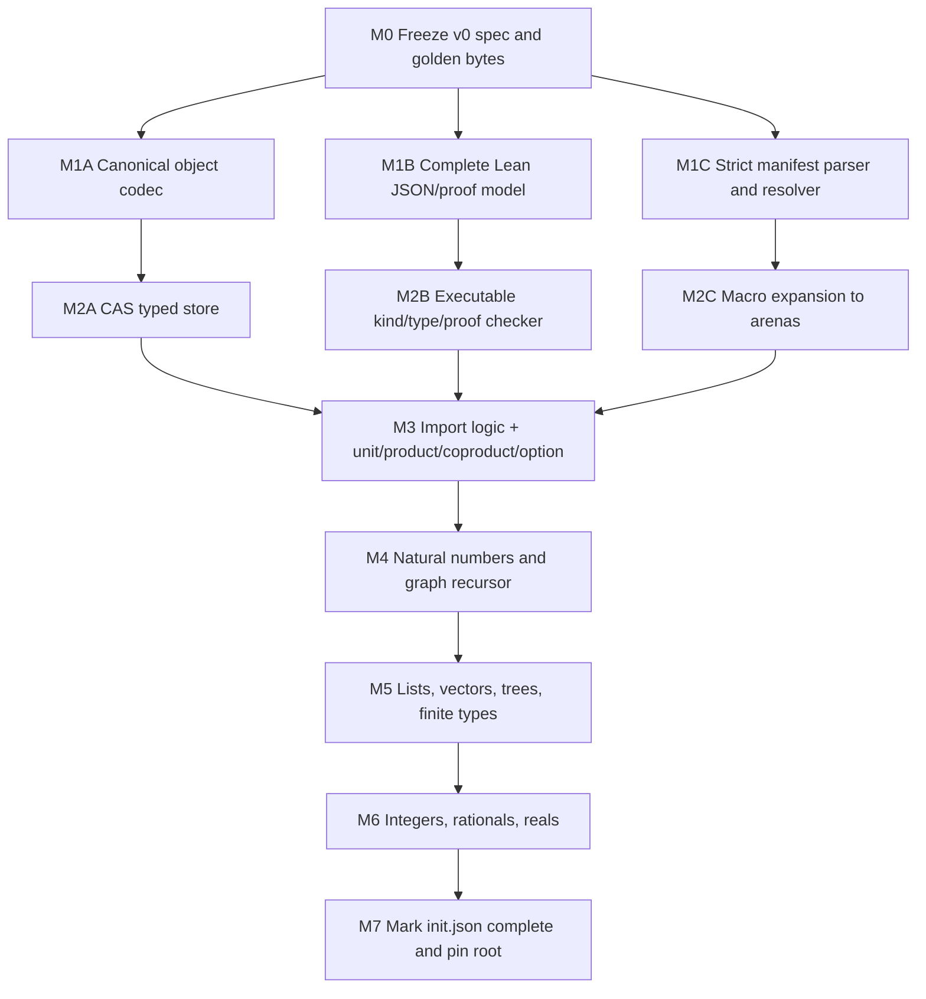

# Kernel and content-addressing implementation plan

This plan turns [`init.json`](init.json) into the first end-to-end
content-addressed HOL import. The semantic contract is in
[`init.md`](init.md).

## Architectural boundary

The trusted kernel should remain small. JSON parsing, friendly names, macro
expansion, dependency scheduling, caching, and pretty-printing are untrusted.
Trust begins only after bytes have been verified against an address and decoded
as a canonical kernel object; the kernel then checks sort, kind, type,
definition, and proof invariants.

```mermaid
flowchart LR
    J[init.json source] --> P[Strict JSON parser]
    P --> R[Name resolver]
    R --> M[Deterministic macro expander]
    M --> A[Backward-reference arena builder]
    A --> E[Scope and sort elaborator]
    E --> T[Typing and kinding checker]
    T --> K[Proof kernel]
    K --> O[Canonical object encoder]
    O --> H[O256 / BLAKE3 addresses]
    H --> C[(CAS)]
    C --> X[Theory root]

    style K stroke-width:3px
    style O stroke-width:3px
```



The thick boundary is the code whose behavior determines logical acceptance or
object identity. Parser limits are security-sensitive, but parser output is
still untrusted until checked.

## Canonical content-addressed objects

Do not hash source JSON. Hash a canonical binary encoding of semantic objects.
Version 0 can use a minimal custom encoding; DAG-CBOR is also acceptable if the
repository commits to its canonical profile and golden bytes. The important
part is that the encoding below is fully deterministic and independently
testable.

### Address

Use the repository’s existing `covalence_lib_hash::O256`, currently BLAKE3-256
for bytes. Each object begins with a domain and version before its payload:

```text
object-bytes = "nucleus.hol.object\0" || uvarint(version) ||
               uvarint(domain-tag) || payload
address      = O256::from_bytes(object-bytes)
```

Hashing the complete typed envelope prevents cross-domain confusion. Never use
bare child concatenation or a JSON rendering as an object preimage.

### Scalar encoding

- unsigned integers: shortest unsigned LEB128/uvarint;
- Boolean: one byte `0` or `1`;
- byte string: length uvarint followed by bytes;
- text: NFC-normalized UTF-8 encoded as a byte string;
- address: exactly 32 bytes, no textual hex inside canonical objects;
- list: count uvarint followed by elements;
- optional value: tag byte followed by zero or one value.

Decoders reject non-shortest integers, invalid UTF-8, non-NFC names, wrong
lengths, unknown tags, trailing bytes, and objects larger than configured
limits. Re-encoding a decoded object must reproduce the fetched bytes exactly.

### Object domains

Use separate tagged domains:

1. `kind` — `star` or an arrow of two kind addresses;
2. `expr` — one `FamilySub` core constructor plus child addresses;
3. `eq-proof` — one `EqTm` constructor plus child addresses/annotations;
4. `proof` — one `Proves` constructor plus child addresses/annotations;
5. `declaration` — class, classifier address, optional body/proof address, and
   parameter telescope information;
6. `declaration-log` — ordered declaration addresses;
7. `name-map` — sorted `(name, declaration-address)` pairs;
8. `theory` — semantics version, parent, declaration log, and name map;
9. `kernel-semantics` — stable identifier for constructor and proof-rule
   meanings; and
10. `source-attestation` (optional) — source byte address, importer version, and
    resulting theory address, excluded from logical identity.

Expressions form a Merkle DAG. A node contains constructor metadata and child
addresses, never child source indices. A loader may use arenas internally, but
arena row order is not semantic and does not enter expression addresses.

### Expression identity

- Bound term and type variables are de Bruijn indices.
- A free term variable node contains its numeric/name identity and its type
  address. This preserves the project-wide “typed free variables” choice.
- Signature primitives contain a reference to their declaring signature entry,
  not a distinguished free-variable spelling.
- Application nodes need not repeat inferred types when typing is unique for
  the active syntax; checked declarations still store their classifier.
- Family applications include kind information only where the constructor
  cannot be decoded unambiguously without it.
- Type conversion is a first-class proof/checking judgement. Syntactically
  different type addresses are not treated as equal merely because a cache or
  resolver is unavailable; equality must be fetched/computed and certified.

This gives structural sharing without conflating syntactic identity with
provable equality. Quotienting terms by provable equality is a library view,
not the CAS key.

## Environment model

The kernel environment is immutable and addressed:

```text
Environment = {
  semantics: KernelSemanticsAddress,
  parent: Option<TheoryAddress>,
  names: NameMapAddress,
  declarations: DeclarationLogAddress
}
```

Lookup returns a declaration address and then fetches/checks that declaration.
Environments cache successful checks keyed by `(semantics, object-address)`.
Cache entries are performance hints only. A missing cache or remote object can
pause elaboration but can never turn unknown equality into equality.

Theory extension is transactional: construct a tentative child environment,
check all declarations, store immutable objects, then publish only the final
root. Orphaned CAS objects after a failed import are harmless and can be
garbage-collected by reachability.

## Loading pipeline



### Failure classes

Return structured errors with declaration index/name and a path into its source
expression:

- source/schema/limit error;
- unresolved or forward name;
- macro expansion error;
- invalid arena reference or scope;
- kind mismatch;
- type mismatch or non-unique typing requiring an annotation;
- invalid definitional equality/type-conversion certificate;
- invalid proof;
- noncanonical stored object;
- missing CAS child;
- fetched bytes/address mismatch; and
- duplicate export or attempted use of a deferred declaration.

Errors must not include nondeterministic map iteration or platform-specific
paths in golden output.

## Kernel modules

The executable implementation should be split along these interfaces:

### 1. `hol-object`

Defines canonical object enums, byte codecs, domain separation, address
calculation, decode limits, and golden vectors. It depends on
`covalence-lib-hash`, not on JSON.

### 2. `hol-store`

Adapts `covalence-data-cas::Cas` to typed `get<T>`/`put<T>` operations. `get`
opens by address, reads bounded complete bytes, verifies the address, decodes
canonically, and checks the expected domain. It supports a memory store first
and the existing HTTP/file CAS later.

### 3. `hol-kernel`

Implements `Kind`, sorted `Expr`, typed free variables, signatures,
definitional equality/type conversion, and all `EqTm`/`Proves` rules. Its API
accepts addresses plus a typed object resolver so checking can suspend/fail on
missing dependencies without guessing.

The Lean `FamilySub` definitions are the executable specification. Each Rust
rule should have a corresponding Lean constructor/theorem and cross-language
fixture. Long-term, prove soundness of the checker or extract the checker from
Lean; initially, keep the rule table visibly one-to-one.

### 4. `hol-theory`

Checks declarations and immutable environments, performs transactional theory
extension, and exposes lookup/reachability. It never parses source JSON.

### 5. `hol-init`

Untrusted source importer: strict JSON/schema checks, name resolution, macro
expansion, arena construction, diagnostic source maps, and theory publication.
This is the only component that understands `nucleus.hol.init.array-v0`.

## Milestones and parallel work



### M0 — freeze the identity contract

- Finalize constructor/domain tag numbers and canonical byte grammar.
- Add golden byte/address vectors for every zero-arity constructor and a nested
  lambda/equality example.
- Decide the kernel-semantics version root.
- Turn the prose inventory into a machine-readable completeness checklist.

Gate: independent Rust and Lean/reference encoders produce identical bytes and
addresses for golden objects.

### M1A — object codec

- Implement bounded canonical encoding/decoding.
- Property-test round trips, rejection of noncanonical encodings, and child
  sensitivity.
- Add typed namespaces/wrappers for expression, proof, declaration, and theory
  addresses even if all use `O256` representation.

Gate: fuzzing never panics or allocates beyond configured limits; all malformed
golden cases reject.

### M1B — complete the formal model

- Extend `FamilySub.Json` from expressions to proof certificates,
  declarations, and theory roots.
- Prove/decide arena back-reference safety and root sort/scope correctness.
- Enumerate every `Proves`/`EqTm` rule in the codec and add round-trip examples.
- Keep type-conversion fetchability explicit in checker inputs.

Gate: `lake build Nucleus.Hol` and exhaustive constructor codec tests pass.

### M1C — strict source frontend

- Replace permissive string expressions with a documented parser or explicit
  tagged arrays.
- Implement Unicode/name, duplicate-key, duplicate-name, and backward-reference
  checks.
- Produce stable source-path diagnostics.

Gate: schema tests plus positive/negative manifest fixtures pass.

### M2 — join the pipelines

- Implement typed CAS access and reachability traversal.
- Implement signature kinding/typing as function where unique, relation where
  intentionally non-unique, and test the uniqueness property separately.
- Implement proof checking one-for-one with Lean.
- Expand macros to core arenas with golden outputs.

Gate: hand-written declarations can be stored, reloaded in a fresh process,
and rejected after any byte tampering.

### M3 — first real content-addressing test

Create a checked prefix fixture containing:

1. derived logic;
2. unit;
3. product;
4. coproduct; and
5. option.

Import it twice from differently formatted JSON. Require identical theory
roots. Copy only the reachable CAS objects into a clean store, load by root,
and check representative beta/eta/no-confusion theorems.

Gate: commit the expected root and reachable object count as a golden test.

### M4/M5 — induction and recursive data

- Finish `NaturalRecursorExistence` using finite compatible graphs.
- Load natural induction/recursion and arithmetic laws.
- Generalize the construction to polynomial functors needed for lists and
  trees, or provide separately proved graph-recursion certificates.
- Load list/vector/tree declarations and their no-confusion/recursion laws.

Gate: the imported theorem addresses can be resolved and independently checked
from the pinned theory root.

### M6 — numeric tower

- Define canonical representative subtypes for integers and rationals.
- Define Dedekind cuts and real operations.
- Check embeddings and algebra/order/completeness theorems.

Gate: no deferred declaration remains in the required inventory.

### M7 — publish bootstrap identity

- Set `status` to `complete`.
- Pin source address, semantic theory root, object-codec version, kernel version,
  and importer version in a release manifest.
- Test import from local memory, hash-named file directory, and HTTP CAS.
- Document reproducible rebuild and migration behavior.

Gate: two clean implementations/stores reproduce the pinned root.

## Security and resource limits

Before network loading, enforce:

- maximum object bytes and manifest bytes;
- maximum JSON and expression nesting;
- maximum rows/declaration and declarations/theory;
- maximum proof nodes and dependency fanout;
- cycle-safe reachability with total object/count limits;
- no implicit network fetch during pure checking unless supplied by an explicit
  resolver capability;
- verified bytes before decoding or caching; and
- negative caching that cannot convert a transient miss into logical failure
  across resolver epochs.

Content addressing guarantees integrity, not availability, authorship, or
logical validity. Proof checking supplies validity; optional signed release
manifests can supply authorship.

## Definition of done

The overall task is complete only when:

- `init.json` contains every required inventory entry and no pseudo-expression
  without a specified deterministic expansion;
- its status is `complete` and schema/semantic/completeness validation passes;
- every declaration checks with no deferred proof;
- canonical object bytes and addresses have golden cross-language tests;
- the kernel loads the theory solely from its root in a fresh store;
- differently formatted equivalent source produces the same root;
- tampering and all malformed-scope/kind/type/proof fixtures reject; and
- the pinned root is reproducible from scratch.

Until then, `design-sketch` is the honest status and the importer must not
advertise the result as a trusted bootstrap theory.

